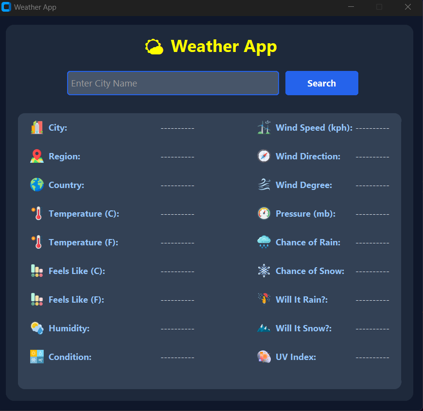
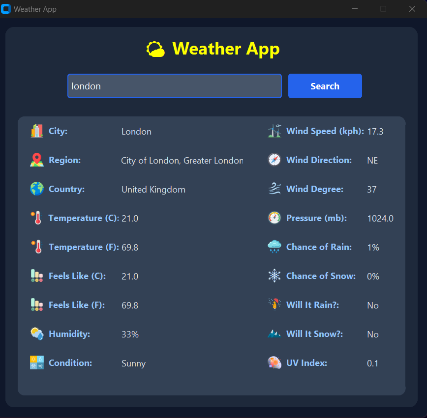
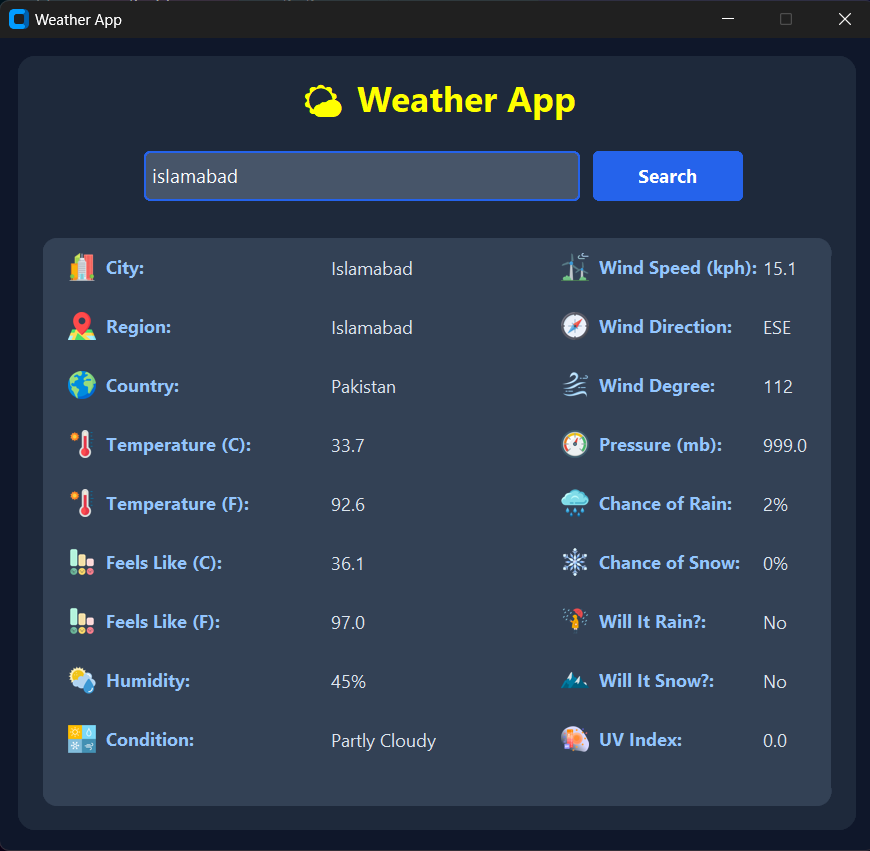

# 🌤 Weather App

A modern desktop Weather Application built with **Python** and **CustomTkinter**. The application fetches real-time weather information using the **WeatherAPI** and displays it in a clean, user-friendly graphical interface.

---

## ✨ Features

- 🔍 Search weather by city name
- 🌡 Current Temperature (°C & °F)
- 🥵 Feels Like Temperature
- 💧 Humidity
- 🌬 Wind Speed
- 🧭 Wind Direction & Degree
- 🌍 Country & Region
- ☀ UV Index
- 📈 Atmospheric Pressure
- 🌧 Chance of Rain
- ❄ Chance of Snow
- 🌤 Current Weather Condition
- ☔ Will It Rain?
- ❄ Will It Snow?
- 🎨 Modern Dark Theme GUI
- 🖼 Weather Icons for Better User Experience
- ⚠ Error handling for invalid city names

---

## 🛠 Technologies Used

- Python 3
- CustomTkinter
- Requests
- Pillow (PIL)
- python-dotenv
- WeatherAPI

---

## 📂 Project Structure

```
Weather-App/
│
├── assets/
│   ├── city.png
│   ├── condition.png
│   ├── humidity.png
│   ├── wind.png
│   ├── temperature.png
│   └── ...
│
├── gui.py
├── weather.py
├── .env
├── .gitignore
└── README.md
```

---

## ⚙ Installation

### Clone the repository

```bash
git clone https://github.com/alizka-projects/Weather_App
```

Move into the project folder

```bash
cd Weather-App
```
---

## 🔑 API Setup

Create a `.env` file in the project folder.

```env
API_KEY=YOUR_API_KEY_HERE
```

Get your free API key from:

https://www.weatherapi.com/

---

## ▶ Run the Application

```bash
python gui.py
```

---

## 📷 Screenshots

### 🏠 Home Screen



---

### 🌤 Weather Results



---

### 🌤 Weather Results



---

## 🚀 Future Improvements

- City autocomplete with dropdown suggestions
- 7-Day Weather Forecast
- Hourly Forecast
- Sunrise & Sunset Information
- Save Recent Searches
- Temperature Charts
- Light/Dark Theme Toggle

---

## 📚 What I Learned

Through this project I learned:

- Working with REST APIs
- Parsing JSON data
- Using environment variables with `.env`
- Building desktop applications using CustomTkinter
- Working with images using Pillow
- Organizing Python projects
- Error handling and user input validation

---

## 👩‍💻 Contributors

**Alishba Khan**  [GitHub:https://github.com/Alishba964]
**Azka Azhar**    [Github:ttps://github.com/azka-azhar]